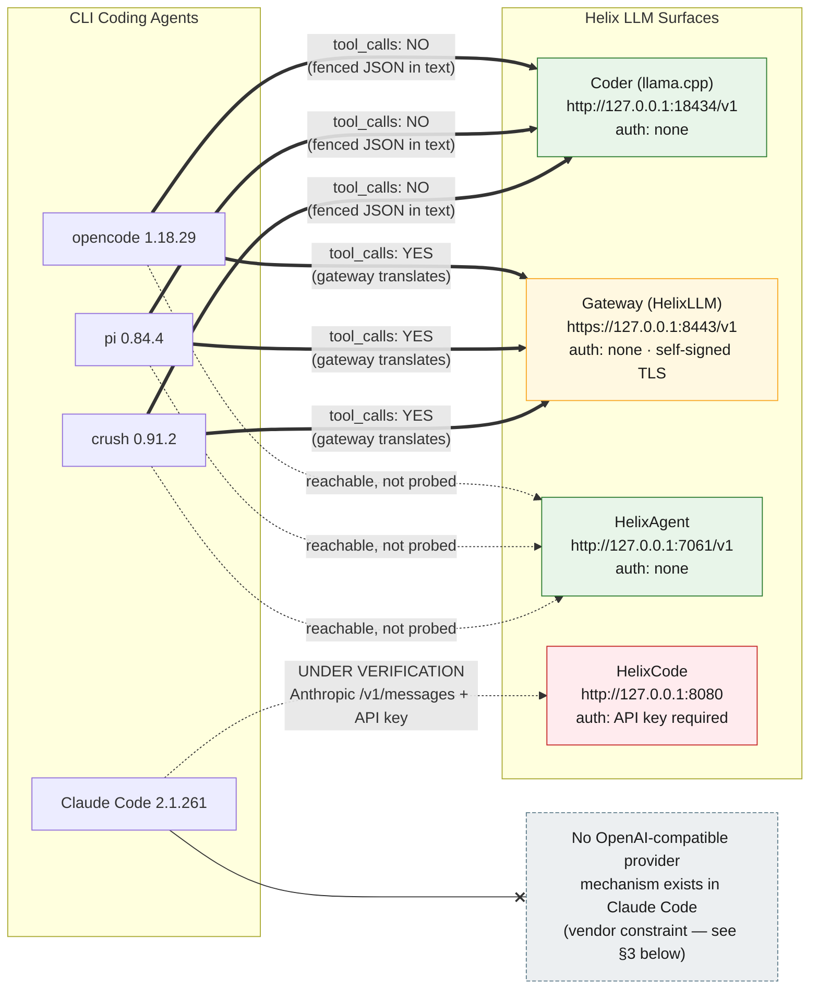

# Architecture — CLI Agents ↔ Helix LLM Surfaces

| Field | Value |
|-------|-------|
| Revision | 1 |
| Created | 2026-09-05 |
| Last modified | 2026-09-05 |
| Status | DRAFT — reflects reachability and capability confirmed by live probes on 2026-09-05, plus cited vendor documentation |
| Status summary | Shows which of the four CLI coding agents can reach which of the four Helix LLM surfaces, where auth/TLS boundaries sit, and where the tool-calling capability actually differs. |
| Scope | Companion to [`README.md`](README.md) and [`FAQ.md`](FAQ.md) in this same directory |
| Authority | Every edge and label below traces to a specific probe or cited vendor doc in `docs/research/cli_agent_config_schemas/EVIDENCE.md` — this diagram makes no claim beyond what that evidence supports. |

---

## Table of contents

1. [How to read this diagram](#1-how-to-read-this-diagram)
2. [The diagram](#2-the-diagram)
3. [Reading the boundaries](#3-reading-the-boundaries)
4. [What the diagram deliberately leaves out](#4-what-the-diagram-deliberately-leaves-out)

---

## 1. How to read this diagram

The left column is the four CLI coding agents; the right column is the four Helix LLM surfaces. An edge means "this agent can be configured to send requests to this surface" — it does **not** mean an agent is currently configured that way on any given machine. Edge style and label carry the capability information:

- **Thick solid arrow (`==>`)** — a confirmed, live-probed capability. The label says exactly what was confirmed (tool-calling present or absent).
- **Dashed arrow (`-.->`)** — reachable in principle (same OpenAI-compatible provider mechanism applies), but the specific behavior was **not probed** in this research pass. Do not infer capability from the arrow alone; check the label.
- **Dashed cross-edge (`--x`)** — no path exists at all. The target is a note, not a surface, explaining the vendor-side reason.

Node fill color marks the surface's auth/TLS posture (see the legend inside the diagram and [§3](#3-reading-the-boundaries) below).

---

## 2. The diagram

**Node color legend:** green = no auth required; amber = no auth required but self-signed TLS must be trusted; red = API key required; grey/dashed = an explanatory note, not a live surface.

---

## 3. Reading the boundaries

- **`opencode`, `pi`, and `crush` all reach Coder, Gateway, and HelixAgent** through the same mechanism — each agent's own custom "OpenAI-compatible provider" feature. This is the whole reason these three agents are grouped together in this guide: same mechanism, three different config file shapes (see [`README.md` §4](README.md#4-per-agent-configuration)).
- **Coder vs. Gateway is the tool-calling boundary**, not an auth or TLS boundary — both surfaces require no API key. The difference is purely in how each surface shapes its response: Coder returns tool-call intent as a fenced JSON blob inside the assistant's plain-text message (which no agent's tool-call parser recognizes), while Gateway translates the same underlying model's output into a real, structured `tool_calls` array with `finish_reason:"tool_calls"`. Same model, two different response shapes, because of what sits between the model and the client on each path.
- **Gateway is also the TLS boundary.** It is the only one of the four surfaces served over HTTPS with a self-signed certificate — every agent reaching it needs that certificate trusted first (`SSL_CERT_FILE` for `crush`; `NODE_EXTRA_CA_CERTS` / `NODE_TLS_REJECT_UNAUTHORIZED` for Node/Bun-based agents in principle, though a full live proof for `opencode` and `pi` against the Gateway was inconclusive — see [`README.md` §5](README.md#5-tls-for-the-self-signed-gateway)).
- **HelixCode is the auth boundary.** It is the only surface of the four that rejects a request outright (HTTP 401) without an API key.
- **Claude Code sits entirely outside the OpenAI-compatible-provider mechanism.** This is not a Helix limitation — it is a documented vendor constraint. Claude Code's own official documentation for the LLM Gateway Protocol (fetched 2026-09-05, `https://code.claude.com/docs/en/llm-gateway-protocol`) lists exactly three client-selectable API formats — Anthropic Messages, Amazon Bedrock InvokeModel, Google Agent Platform `rawPredict` — with no OpenAI Chat Completions option, and the companion LLM Gateway page states outright that Anthropic "doesn't support routing Claude Code to non-Claude models through any gateway." Claude Code's optional model-discovery step additionally filters by name, keeping only ids containing `claude` or `anthropic`. The only candidate path into Helix from Claude Code is HelixCode's Anthropic-shaped `/v1/messages` endpoint on `:8080` — drawn here as **under verification**, because a separate work stream was still establishing whether it actually works at the time this diagram was produced.

---

## 4. What the diagram deliberately leaves out

- **HelixAgent's tool-calling behavior** is drawn as "reachable, not probed" rather than a confirmed yes/no, because this research pass did not test it. Do not read the dashed line as "it doesn't work" — it means "unconfirmed either way." See [`README.md` §2](README.md#2-the-four-helix-surfaces).
- **Whether an agent is currently configured this way on any particular machine.** This diagram shows what is *possible* given each agent's own provider mechanism and each surface's own behavior — it is not a snapshot of any one operator's live config. Verify your own machine with the commands in [`README.md` §6](README.md#6-verifying-each-agent-yourself).
- **HelixCode's `/v1/chat/completions` shape** is mentioned in [`README.md` §2](README.md#2-the-four-helix-surfaces) but not drawn separately here, since no agent in this guide has a confirmed path to either of HelixCode's two endpoint shapes yet.
